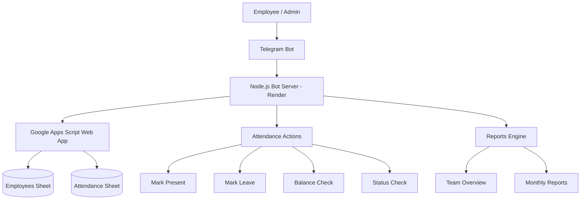

# TinkerHub Attendance Bot

A production-style Telegram-based attendance and leave management system built using:

- Node.js (Telegram Bot API + Express)
- Google Apps Script (Backend API layer)
- Google Sheets (Database)
- Render (Deployment)

Live System: https://attendance-bot-qn86.onrender.com/
Telegram Bot: @tinkerhub_attend_bot

---

## System Architecture



---

## Tech Stack

- Node.js (Telegram Bot via polling)
- Express.js (health check server)
- Google Apps Script (serverless backend API)
- Google Sheets (data storage)
- Axios (API communication)
- Render (cloud deployment)

---

## Features

### Employee Features

- `/start` - Register automatically
- One-click attendance marking (Present / Leave)
- Instant leave balance (4 leaves/month)
- View personal monthly attendance summary

### Admin Features

- Real-time team status: Present / On Leave / Not Marked
- Monthly attendance reports for all employees
- Full visibility of team activity

---

## Google Sheet Structure

**Employees Sheet:**

| telegram_id | name | joined_date |

**Attendance Sheet:**

| telegram_id | name | date | status | timestamp |

---

## System Behavior

- Each user can mark only one attendance per day
- If same status is selected again - "Already marked as X"
- If status changes - existing record is updated, not duplicated
- All timestamps are stored in IST (Asia/Kolkata)
- Leave balance resets every calendar month
- Unused leaves do not carry forward

---

## API Actions (Apps Script Layer)

- `register`
- `markAttendance`
- `getBalance`
- `getStatus`
- `getTeam`
- `getReport`
- `isRegistered`

---

## Setup Instructions

### 1. Google Sheets Setup

Create a Google Sheet with two tabs: Employees and Attendance.

### 2. Apps Script Setup

- Open Sheet > Extensions > Apps Script
- Paste backend script
- Deploy > Web App
- Execute as: Me
- Access: Anyone
- Copy the Web App URL

### 3. Environment Variables

```
BOT_TOKEN=your_telegram_bot_token
APPS_SCRIPT_URL=your_web_app_url
ADMIN_TELEGRAM_ID=your_telegram_id
```

### 4. Deploy on Render

- Push Node.js project to GitHub
- Add environment variables in Render dashboard
- Start service

---

## Engineering Highlights

- Idempotent attendance system (no duplicate entries per day)
- Hybrid backend architecture (Node.js + Apps Script)
- Google Sheets used as lightweight database
- Robust date normalisation across all layers
- Safe retry handling for API failures
- Single-click Telegram UX for minimal friction

---

## System Limitations

- Depends on Google Apps Script execution quotas
- Performance may slow with large datasets (>10k rows)
- Uses Telegram polling instead of webhook
- No offline support

---

## Future Improvements

- Telegram webhook migration
- Admin dashboard (React / Next.js)
- Attendance streak tracking
- Monthly leaderboard
- Export reports as PDF or CSV
- Replace Sheets with PostgreSQL or Firebase

---

## Testing Guide

1. Start bot with `/start`
2. Register as a user
3. Mark Present or Leave
4. Try duplicate marking
5. Check balance and status
6. Admin: test `/team` and `/report`

---

## Why This System Works

- Zero-friction attendance tracking
- Real-time team visibility
- No external app dependency
- Fast deployment using free tools

Suitable for small teams, student organisations, hackathons, and internal company tools.

---

## Security Notes

- Never expose `BOT_TOKEN`
- Protect your Apps Script URL
- Admin access is controlled via Telegram ID
