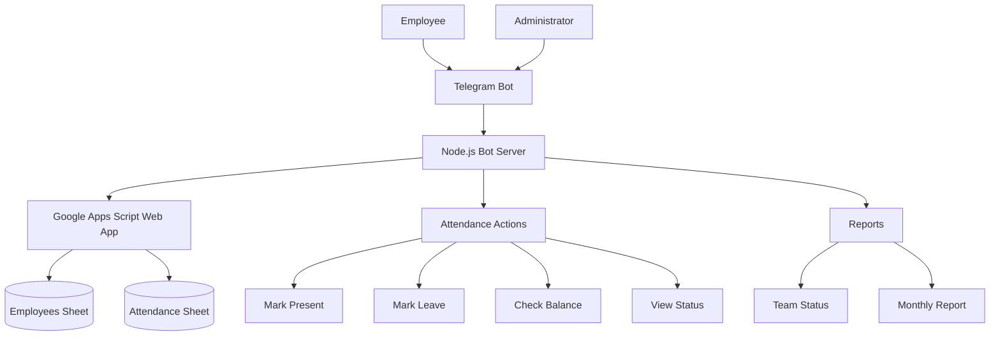

# TinkerHub Attendance Bot

A Telegram bot for daily attendance tracking and leave management. Designed for small to medium sized teams.

## Architecture



## Features

### Employee
- `/start` — Register and get the attendance panel
- One tap to mark Present or Leave
- Check leave balance (4 per month, no carryover)
- View personal attendance summary for the month

### Admin
- View real-time team status: Present / Leave / Not Marked
- Generate monthly attendance report for all employees

## Setup

### 1. Google Sheet
Create a Google Sheet with two tabs:

**Employees**
| telegram_id | name | joined_date |

**Attendance**
| telegram_id | name | date | status | timestamp |

### 2. Apps Script
- Open the sheet, go to Extensions > Apps Script
- Paste the contents of `apps_script.gs`
- Go to Project Settings > Script Properties
- Add property: `ADMIN_TELEGRAM_ID` = your Telegram user ID
- Click Deploy > New Deployment > Web App
- Set "Who has access" to "Anyone"
- Copy the Web App URL

### 3. Environment Variables
Copy `.env.example` to `.env` and fill in:
```
BOT_TOKEN=your_telegram_bot_token
APPS_SCRIPT_URL=your_apps_script_web_app_url
ADMIN_TELEGRAM_ID=your_telegram_user_id
```

### 4. Deploy

The application can be deployed on Railway, Render, Koyeb, or any Node.js hosting platform.

Required environment variables:

BOT_TOKEN
APPS_SCRIPT_URL
ADMIN_TELEGRAM_ID

## Why This Design?

The solution was designed around two requirements:

1. Frictionless attendance marking
   - Employees can mark attendance with a single tap using Telegram inline buttons.
   - No dashboards, forms, or additional logins are required.

2. Real-time visibility
   - Employees can instantly view leave balances and attendance history.
   - Administrators can access team status and monthly reports without manual counting.

The system intentionally uses Google Sheets as the data store to keep deployment and maintenance simple for small organizations.

## For Evaluators

To test with your own Telegram account as admin:
1. Get your Telegram user ID by messaging @userinfobot
2. Set `ADMIN_TELEGRAM_ID` to that value in Railway's Variables tab
3. Redeploy

## Notes

- Attendance records are idempotent: marking attendance twice on the same day updates the existing record rather than creating a duplicate
- `/team` shows three states: Present, On Leave, Not Marked - giving the admin a complete picture without manual counting
- Leave balance resets at the start of each calendar month
- Unused leaves do not carry over
- The system automatically supports any number of employees because attendance and employee records are stored dynamically in Google Sheets. No code changes are required when new employees join.